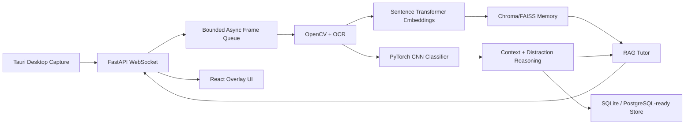

# Architecture

Lumina Learn is split into transport, inference, memory, and UI layers.

## Dependency Boundaries

- `apps/backend` owns HTTP/WebSocket transport, orchestration, and persistence.
- `packages/vision` owns capture, frame decoding, preprocessing, and OCR.
- `packages/activity-classifier` owns neural screen classification.
- `packages/ai-core` owns embeddings, local/cloud inference provider contracts, context classification, and tutoring.
- `packages/memory` owns vector persistence and RAG retrieval.
- `packages/shared` owns event schemas that cross process boundaries.
- `packages/overlay-ui` owns reusable overlay presentation components.

## Runtime Flow

1. Desktop captures a monitor frame and encodes JPEG locally.
2. Backend receives bytes on `/ws/realtime`.
3. Session orchestrator queues frame work and returns status immediately when overloaded.
4. Vision pipeline decodes and normalizes the image, extracts OCR text, and emits frame metadata.
5. CNN classifier predicts activity and educational-context probabilities.
6. Context service embeds OCR plus classifier labels, stores it in vector memory, and computes distraction risk.
7. Tutor service retrieves relevant memories and generates a local transformer response.
8. Backend persists the event and pushes a typed WebSocket payload to the overlay.

Heavy OCR, embedding, and reasoning models are loaded lazily on first use so health checks and startup do not block on model downloads. When no classifier checkpoint is configured in development, a deterministic heuristic classifier is used instead of random untrained neural outputs; production deployments should require a trained checkpoint.

## Scaling Path

- Move inference services behind an internal async RPC boundary.
- Add GPU batch workers for CNN and embedding workloads.
- Use Redis/NATS for queue fan-out.
- Replace SQLite URL with PostgreSQL URL and reuse the repository interface.
- Use Chroma server or managed vector storage for multi-device accounts.
